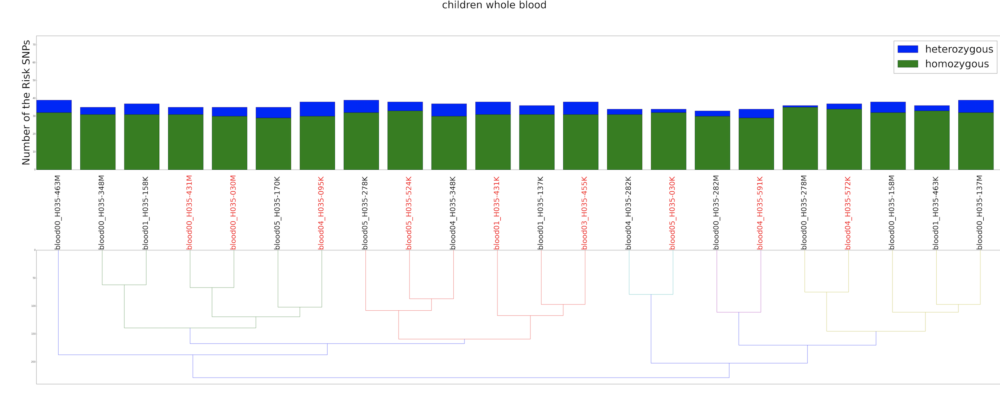

# Combine Stacked Barplot with Dendrogram

Example: carry out hierachical clustering on the SNPs genotype pattern for all the samples
         and show the level of heterozygous and homozygous SNPs in each sample 
         
## data structure for bar plot 

| samples          | heterozygou| homozygous |total| 
|------------------|:----------:|:----------:|:---:|
| blood05_H035-030K| 15         | 12         |27   |

## data structure for dendrogram

| blood05_H035-030K | blood05_H035-031K   | blood05_H035-032K |   id       |
| ------------------|:-------------------:|:-----------------:|:----------:|
| 3                 | 3                   | 3                 | rs17541203 |

## Result 

